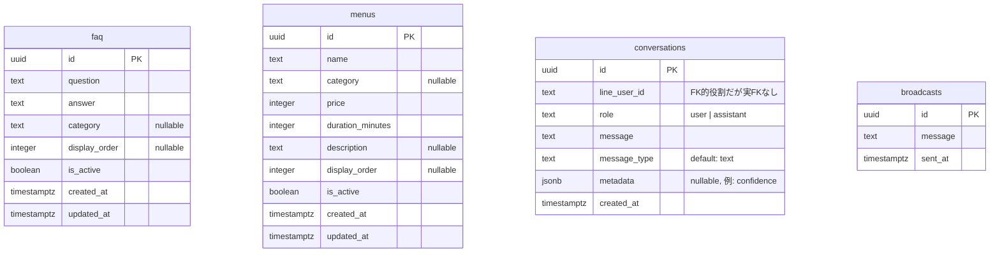
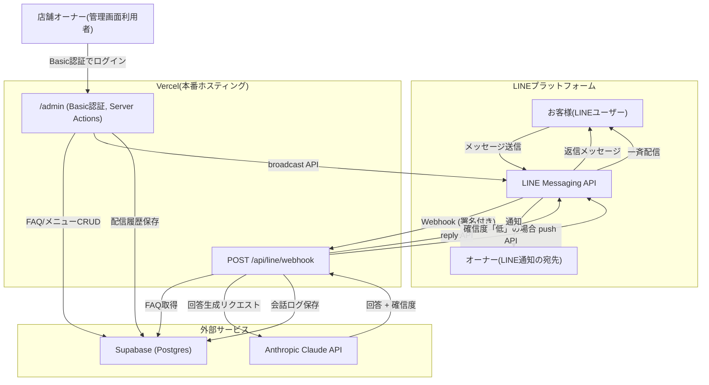

# 技術ドキュメント(引き継ぎ用)

このドキュメントは、このプロジェクトを引き継ぐエンジニア向けに、API仕様・DB設計・
外部サービス連携をまとめたものです。

- 環境構築の手順は [docs/setup-guide.md](./setup-guide.md) を参照してください。
- オーナー向けの操作手順は [docs/operation-manual.md](./operation-manual.md) を参照してください。

---

## 1. システム概要

美容室向けのLINE公式アカウントBotです。お客様がLINEでメッセージを送ると、
店舗が事前に登録したFAQをもとに、Claude(Anthropic)がその場で回答を生成して返信します。

主な特徴:
- 回答の根拠はFAQ(`faq`テーブル)のみ。FAQにない内容は一般論では答えず、店舗への問い合わせ案内を返す設計(`lib/claude.ts` のシステムプロンプト参照)。
- 回答ごとに確信度(高/中/低)を判定し、「低」の場合はオーナーへLINEで自動通知する。
- 店舗オーナー向けにBasic認証付きの管理画面(`/admin`)があり、FAQ・メニュー・お知らせ配信・会話ログを扱える。
- ホスティングはVercel、DBはSupabase(Postgres)、AIはAnthropic Claude API、メッセージングはLINE Messaging API。

### ディレクトリ構成(主要部分)

```
app/
  api/line/webhook/route.ts   … LINEからのWebhookを受けるAPIルート(唯一の公開APIエンドポイント)
  admin/                       … 管理画面(App Router、Server Actionsで動作)
lib/
  line.ts                      … LINE Messaging APIラッパー(署名検証・reply/push/broadcast)
  claude.ts                    … Claude APIラッパー(FAQベースの回答生成)
  supabase/                    … Supabaseアクセス層(faq / menus / conversations / broadcasts)
proxy.ts                       … Next.js 16のミドルウェア相当。/admin配下にBasic認証をかける
```

---

## 2. API仕様

### 2-1. 公開APIエンドポイント

このアプリが外部(LINEプラットフォーム)から呼び出される、公開HTTPエンドポイントは
**1つだけ**です。

#### `POST /api/line/webhook`

LINE Messaging Platformから、ユーザーのメッセージイベントなどを受け取るWebhook。

**リクエスト**
- LINEプラットフォームが送信する標準のWebhookペイロード(`events[]` を含むJSON)。
- ヘッダー `x-line-signature` に、Channel Secretで署名したHMAC-SHA256(Base64)が入っている。

**認証・検証**
- `lib/line.ts` の `verifyLineSignature()` が、生のリクエストボディに対して
  `LINE_CHANNEL_SECRET` でHMAC-SHA256を計算し、`x-line-signature` ヘッダーと
  タイミングセーフに比較する。
- 署名が一致しない場合は `401 Invalid signature` を返す。

**処理内容(`event.type === "message"` かつテキストメッセージの場合のみ)**
1. ユーザーの発言を `conversations` テーブルに記録(`role: "user"`)。
2. `getActiveFaqs()` で公開中のFAQを全件取得。
3. `answerFaqQuestion()`(Claude API)にFAQと質問を渡し、`{ answer, confidence }` を取得。
4. LINEの reply API で回答を返信。
5. Botの回答を `conversations` テーブルに記録(`role: "assistant"`、`metadata.confidence` に確信度を保存)。
6. `confidence === "低"` の場合、`LINE_OWNER_USER_ID` に列挙されたユーザー全員にpushメッセージで通知(`Promise.allSettled` で並列送信し、個々の失敗はログのみで処理は継続)。
7. 上記のいずれかで例外が発生した場合は、ユーザーに「現在回答できません」という定型文をreplyで返す。

**レスポンス**
- 常に `200 OK`("OK")を返す(LINE側の再送を防ぐため、個々のイベント処理エラーは
  内部でcatchし、HTTPレベルでは失敗させない設計)。
- 署名検証失敗時のみ `401`。

**イベントの並列処理**
- `body.events` は `Promise.all` で並列処理される。1イベントの処理失敗が他イベントに
  影響しないよう、各イベント処理は個別にtry/catchされている。

### 2-2. 管理画面の操作(Server Actions)

`/admin` 配下はREST APIではなく、Next.jsのServer Actions(フォームの`action`に
直接関数を渡す方式)で実装されている。外部から直接HTTPで叩くことは想定していない
(HTMLフォーム経由でのみ呼ばれる、CSRF対策はNext.jsのServer Actions機構に準拠)。

| Action | 場所 | 内容 |
|---|---|---|
| `createFaqAction` / `updateFaqAction` / `deleteFaqAction` | `app/admin/actions.ts` | FAQのCRUD |
| `createMenuAction` / `updateMenuAction` / `deleteMenuAction` | `app/admin/menus/actions.ts` | メニューのCRUD |
| `broadcastAction` | `app/admin/broadcast/actions.ts` | LINE友だち全員への一斉配信(`broadcastMessage`)+ 配信履歴の記録(`logBroadcast`) |

`broadcastAction` の入力チェック: 空文字不可、5000文字以内(`MAX_MESSAGE_LENGTH`)。

### 2-3. 認証

- `/admin/:path*` 全体に、`proxy.ts`(Next.js 16のmiddleware相当)でHTTP Basic認証を適用。
- 認証情報は環境変数 `ADMIN_BASIC_AUTH_USER` / `ADMIN_BASIC_AUTH_PASSWORD`。
- ユーザー名・パスワードの比較は `timingSafeEqual` によるタイミングセーフ比較。
- 環境変数が未設定の場合は `500 Admin Basic Auth is not configured` を返す(フェイルクローズ)。

### 2-4. このアプリが呼び出す外部API

| API | 用途 | 呼び出し箇所 |
|---|---|---|
| LINE Messaging API `POST /v2/bot/message/reply` | ユーザーへの個別返信 | `lib/line.ts` `replyMessage()` |
| LINE Messaging API `POST /v2/bot/message/push` | オーナーへの低確信度通知 | `lib/line.ts` `pushMessage()` |
| LINE Messaging API `POST /v2/bot/message/broadcast` | お知らせの一斉配信 | `lib/line.ts` `broadcastMessage()` |
| Anthropic Messages API(`claude-sonnet-5`) | FAQベースの回答生成(JSON Schema出力・プロンプトキャッシュ利用) | `lib/claude.ts` `answerFaqQuestion()` |
| Supabase(PostgREST経由) | FAQ/メニュー/会話ログ/配信履歴のCRUD | `lib/supabase/*.ts` |

いずれも失敗時は例外を投げ、呼び出し元(webhookハンドラやServer Action)でcatchして
ユーザー向けのフォールバック応答やエラーメッセージに変換している。リトライ処理は
実装されていない(LINE APIやClaude APIが一時的に失敗した場合、その1回のやり取りは
失敗として扱われる)。

---

## 3. DB設計(Supabase / Postgres)

テーブル間の外部キー関係は**なし**(すべて独立したテーブル)。スキーマの正は
Supabase側の実データベースであり、`lib/supabase/types.ts` はそこから生成された
型定義。リポジトリにマイグレーションファイルは含まれていない(詳細は
[setup-guide.md](./setup-guide.md#4-supabaseのセットアップ) 参照)。



### 3-1. `faq` — Botの回答の唯一の情報源

| カラム | 型 | 説明 |
|---|---|---|
| `id` | uuid | 主キー |
| `question` | text | 想定質問 |
| `answer` | text | 回答 |
| `category` | text? | 任意の分類ラベル |
| `display_order` | integer? | 管理画面での並び順(昇順、NULLは末尾) |
| `is_active` | boolean | `true`のFAQのみBotの回答生成に使われる(`getActiveFaqs()`) |
| `created_at` / `updated_at` | timestamptz | |

Botの回答生成(`lib/claude.ts`)は、このテーブルの `is_active = true` の行だけを
コンテキストとしてClaudeに渡す。**このテーブルの内容だけがBotの回答根拠。**

### 3-2. `menus` — メニュー・料金の一覧(⚠️ Botの回答には未使用)

| カラム | 型 | 説明 |
|---|---|---|
| `id` | uuid | 主キー |
| `name` | text | メニュー名 |
| `category` | text? | 分類 |
| `price` | integer | 価格(円) |
| `duration_minutes` | integer | 所要時間(分) |
| `description` | text? | 説明 |
| `display_order` | integer? | 並び順 |
| `is_active` | boolean | 非公開フラグ(管理画面の表示のみに影響) |
| `created_at` / `updated_at` | timestamptz | |

管理画面(`/admin/menus`)からCRUDできるが、**webhookハンドラも`lib/claude.ts`も
このテーブルを一切参照していない**。将来Botの回答に組み込む場合は、
`app/api/line/webhook/route.ts` で `getActiveFaqs()` と併せて `menus` を取得し、
`lib/claude.ts` のプロンプトコンテキストに含める改修が必要。

### 3-3. `conversations` — 会話ログ

| カラム | 型 | 説明 |
|---|---|---|
| `id` | uuid | 主キー |
| `line_user_id` | text | LINEのユーザーID。他テーブルへの外部キーではなく、グルーピング用の識別子 |
| `role` | text | `"user"` または `"assistant"` |
| `message` | text | 発言内容 |
| `message_type` | text | 既定値 `"text"`(現状テキストメッセージのみ扱う) |
| `metadata` | jsonb? | assistant発言の場合、`{ "confidence": "高"\|"中"\|"低" }` を格納 |
| `created_at` | timestamptz | |

`getConversationThreads()` は直近 `MAX_RECENT_CONVERSATIONS = 500` 件を取得し、
`line_user_id` でアプリケーション側(JS)でグルーピングしている。DB側でのGROUP BYや
ページネーションは実装されていないため、データ量が増えた場合は要見直し。

### 3-4. `broadcasts` — 配信履歴

| カラム | 型 | 説明 |
|---|---|---|
| `id` | uuid | 主キー |
| `message` | text | 配信したメッセージ本文 |
| `sent_at` | timestamptz | 送信日時 |

LINEへの実際の配信(`broadcastMessage`)が成功した**後**に記録される。
記録(`logBroadcast`)自体が失敗しても、配信は既に成功しているためユーザー(オーナー)
にはエラーとして表示しない設計(`app/admin/broadcast/actions.ts` 参照)。

### 3-5. アクセス方式とRLS

- アプリ側は基本的に `supabaseAdmin`(service roleキー、`lib/supabase/admin.ts`)経由でのみ
  アクセスしている。RLSをバイパスするため、`SUPABASE_SERVICE_ROLE_KEY` の取り扱いには注意。
- anonキー用のクライアント(`lib/supabase/client.ts`)も用意されているが、
  **現状どこからも使われていない**(ブラウザから直接Supabaseを叩く処理は無い)。

---

## 4. 外部サービス連携図



**ポイント**
- Botの応答経路(お客様 → LINE → Webhook → Claude/Supabase → LINE → お客様)と、
  管理経路(オーナー → 管理画面 → Supabase/LINE)は、どちらも同じVercelアプリ内で
  処理されるが、認証方式が異なる(前者はLINE署名検証、後者はBasic認証)。
- ローカル開発時は、LINEプラットフォームからVercelの代わりに ngrok 経由でローカルの
  `next dev` サーバーに届く構成になる(詳細は [setup-guide.md](./setup-guide.md#8-ローカルでの起動方法))。

---

## 5. 既知の制約・技術的負債

- **`menus` テーブルがBotの回答に未接続**(3-2参照)。仕様なのか未実装なのか要確認。
- **マイグレーションファイルが存在しない**。スキーマ変更はSupabaseダッシュボード/SQL Editorで
  直接行われており、変更履歴がGit管理下にない。`supabase/migrations` の導入を推奨。
- **自動テストが存在しない**(`package.json` にtestスクリプトなし)。
- **外部API呼び出しにリトライ機構がない**(LINE API・Claude APIとも1回失敗したら
  そのやり取りは失敗扱い)。
- **`conversations` の集計がアプリケーション側のインメモリ処理**(3-3参照)。データ量が
  増えた場合はDB側の集計・ページネーションへの移行を検討。
- **ngrokの無料プランはURLが再起動のたびに変わる**ため、ローカル検証のたびにLINE側の
  Webhook URL再設定が必要。

---

_最終更新: 2026-08-10_
